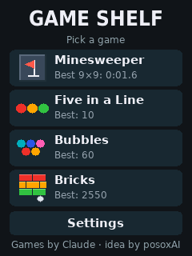

# CYD Game Shelf

[Русская версия](README.ru.md)

Two games and a menu for the "Cheap Yellow Display", the ESP32 board with a 2.8-inch touch screen: Minesweeper and Five in a Line. The interface is in English and Russian.

<p>
  
  
  
</p>

The pictures come from the computer simulator in `sim/`, which runs the same game code as the board.

## Status

The game rules and every screen are tested on a computer. The part that talks to the real screen, touch panel and flash memory is short and follows the usual setup for this board, but it could not be compiled or run where the code was written. Expect to adjust something on the first run; the Troubleshooting section lists the likely things.

## The board

ESP32-2432S028R with one micro-USB socket: an ESP-WROOM-32 module, a 240 × 320 ILI9341 screen and an XPT2046 resistive touch panel. The version with two USB sockets has a different screen driver and needs other settings in `platformio.ini`.

## Build and flash

The project is built with [PlatformIO](https://platformio.org/).

```
pio run -t upload
pio device monitor
```

PlatformIO downloads the ESP32 toolchain and the screen library, TFT_eSPI, by itself. The library is configured by the flags in `platformio.ini`, so none of its files need editing.

## First start

1. **Touch calibration.** Four crosses appear one after another. Press each one and hold until it disappears. A stylus or a fingernail is more precise than a fingertip.
2. **Language.** Choose Russian or English.

Both are remembered. They can be changed later in Settings.

## The games

**Minesweeper.** Two fields: 9 × 9 with 10 mines and 16 × 16 with 40 mines. A tap opens a cell, a long press plants a flag. The Dig / Flag button swaps the two. A tap on an open number opens its neighbours once that many flags surround it. The first opened cell and its neighbours never hold a mine. The best time is kept for each field. The 16 × 16 field has small cells and wants a stylus.

**Five in a Line.** Tap a marble, then a free cell: the marble moves there if a path is free. Five or more of one colour in a row disappear and score. After a move without a line three new marbles arrive. The game ends when the board is full.

A game stays in memory while you are in the menu or in the other game. It is lost when the power goes off.

## Settings

- Language: RU or EN.
- Sound: simple tones on the speaker connector. Nothing is heard unless a speaker is plugged in.
- Screen: turns the picture by 180 degrees.
- Colours: for boards that show the colours inverted.
- Marks: a little sign inside every marble in Five in a Line — a dot, a ring, a bar and so on, one for each colour. It is on to begin with, because these panels render some colours close to each other. Turn it off for plain marbles.
- Touch calibration.
- Reset best results.

## Troubleshooting

- **Touches land in the wrong place and the menu cannot be used.** Hold a finger on the screen, or hold the BOOT button, while the board powers on. Calibration starts again.
- **Calibration keeps saying it did not work.** The numbers at the bottom of the calibration screen are the raw readings of the panel. If they do not change when you press in different places, the touch wiring differs from this board. The same readings go to the serial monitor.
- **The picture is upside down.** Settings, Screen.
- **Colours look like a photo negative.** Settings, Colours.
- **Red and blue are swapped.** Add `-DTFT_RGB_ORDER=TFT_RGB` to `build_flags` in `platformio.ini`. If that makes it worse, use `TFT_BGR`.
- **The screen stays white or black.** This is usually the two-USB version of the board. It needs `-DST7789_DRIVER=1` in place of `-DILI9341_2_DRIVER=1`.

## Tests on a computer

```
sim/run.sh
```

The script builds the games with `g++`, plays several hundred games of each to check the rules, drives every screen with a scripted finger and saves pictures of the screens to `sim/out`. It needs `g++` and Python, nothing else.

## Files

- `src/app.cpp`: touch, sound, settings, calibration, menu.
- `src/game_mines.cpp`, `src/game_lines.cpp`: the games.
- `src/ui.cpp`, `src/font_data.cpp`: text drawing and the fonts. The fonts are generated by `tools/make_font.py`.
- `src/strings.cpp`: every text in both languages.
- `src/hw.h`: what the games need from the board. `src/hw_esp32.cpp` provides it on the board, `sim/hw_host.cpp` on a computer.

## Credits

The firmware was written by Claude, the AI assistant made by Anthropic: the game logic, the screens, the touch handling and the simulator.

The idea and the choice of games came from posoxAI. Both games are ports of the browser versions: [Minesweeper](https://github.com/posoxAI/MinesweeperGame) and [Five in a Line](https://github.com/posoxAI/FiveInLineGame).

The letters are drawn from the DejaVu fonts, which are free to use and to embed.

## License

MIT. The full text is in [LICENSE](LICENSE).
