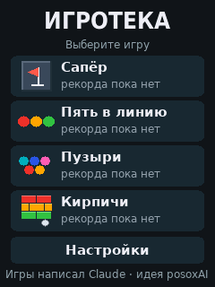
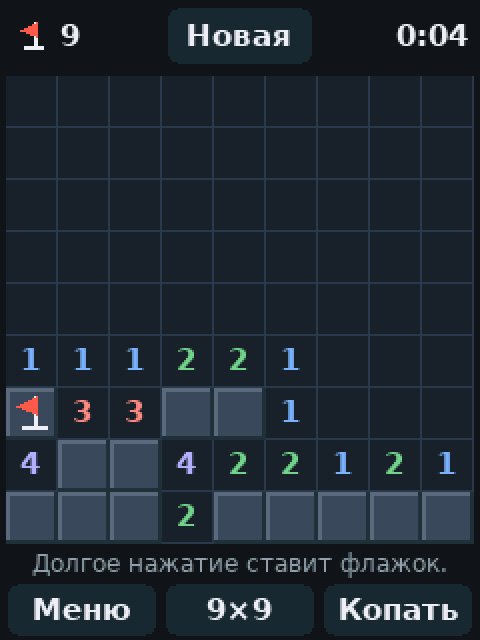
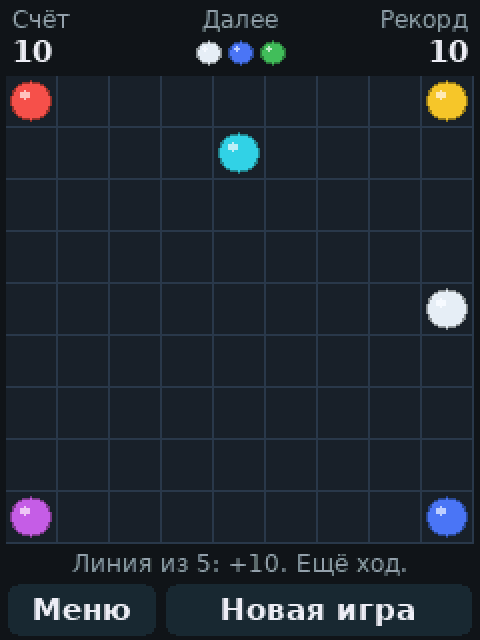

# CYD Game Shelf

[English version](README.md)

Две игры и меню для «Cheap Yellow Display», платы ESP32 с сенсорным экраном 2,8 дюйма: «Сапёр» и «Пять в линию». Интерфейс на русском и английском.

<p>
  
  
  
</p>

Картинки сняты с эмулятора из папки `sim/`: он выполняет тот же код игр, что и плата.

## Состояние

Правила игр и все экраны проверены на компьютере. Часть, которая работает с настоящим экраном, тачскрином и флеш-памятью, короткая и повторяет обычную настройку этой платы, но собрать и запустить её там, где писался код, было нельзя. При первом запуске, скорее всего, что-то придётся подправить; вероятные случаи описаны в разделе «Если что-то не так».

## Плата

ESP32-2432S028R с одним разъёмом micro-USB: модуль ESP-WROOM-32, экран ILI9341 240 × 320 и резистивный тачскрин XPT2046. У версии с двумя USB-разъёмами другой драйвер экрана, ей нужны другие настройки в `platformio.ini`.

## Сборка и прошивка

Проект собирается в [PlatformIO](https://platformio.org/).

```
pio run -t upload
pio device monitor
```

PlatformIO сам скачает инструменты ESP32 и библиотеку экрана TFT_eSPI. Библиотека настраивается флагами в `platformio.ini`, её файлы править не нужно.

## Первый запуск

1. **Калибровка касаний.** По очереди появляются четыре крестика. Нажмите на каждый и держите, пока он не исчезнет. Стилус или ноготь точнее подушечки пальца.
2. **Язык.** Выберите русский или английский.

То и другое запоминается. Позже это меняется в настройках.

## Игры

**Сапёр.** Два поля: 9 × 9 с 10 минами и 16 × 16 с 40 минами. Нажатие открывает клетку, долгое нажатие ставит флажок. Кнопка «Копать / Флаг» меняет их местами. Нажатие на открытое число открывает соседей, если вокруг стоит столько же флажков. В первой открытой клетке и рядом с ней мин не бывает. Рекорд времени хранится для каждого поля. На поле 16 × 16 клетки мелкие, там нужен стилус.

**Пять в линию.** Нажмите на шарик, затем на свободную клетку: шарик переедет туда, если путь свободен. Пять и больше шариков одного цвета в ряд исчезают и приносят очки. После хода без линии появляются три новых шарика. Игра кончается, когда поле заполнено.

Партия остаётся в памяти, пока вы в меню или в другой игре. При выключении питания она теряется.

## Настройки

- Язык: RU или EN.
- Звук: простые тоны на разъёме динамика. Без подключённого динамика ничего не слышно.
- Экран: поворачивает картинку на 180 градусов.
- Цвета: для плат, которые показывают цвета инвертированными.
- Метки: значок внутри каждого шарика в «Пяти в линию» — точка, кольцо, полоска и так далее, свой на каждый цвет. Включены изначально, потому что эти панели показывают некоторые цвета похоже друг на друга. Выключите, если хотите чистые шарики.
- Калибровка касаний.
- Сброс рекордов.

## Если что-то не так

- **Касания попадают не туда, меню не работает.** Держите палец на экране или кнопку BOOT, пока плата включается. Калибровка начнётся заново.
- **Калибровка всё время сообщает, что не получилось.** Числа внизу экрана калибровки показывают сырые показания тачскрина. Если они не меняются при нажатии в разных местах, тачскрин подключён не так, как на этой плате. Те же показания идут в монитор порта.
- **Картинка вверх ногами.** Настройки, «Экран».
- **Цвета как на негативе.** Настройки, «Цвета».
- **Красный и синий поменялись местами.** Добавьте `-DTFT_RGB_ORDER=TFT_RGB` в `build_flags` в `platformio.ini`. Если стало хуже, поставьте `TFT_BGR`.
- **Экран остаётся белым или чёрным.** Обычно это версия платы с двумя USB. Ей нужен `-DST7789_DRIVER=1` вместо `-DILI9341_2_DRIVER=1`.

## Проверка на компьютере

```
sim/run.sh
```

Скрипт собирает игры компилятором `g++`, разыгрывает по нескольку сотен партий каждой для проверки правил, проходит все экраны «пальцем» по сценарию и сохраняет картинки экранов в `sim/out`. Нужны только `g++` и Python, больше ничего.

## Файлы

- `src/app.cpp`: касания, звук, настройки, калибровка, меню.
- `src/game_mines.cpp`, `src/game_lines.cpp`: игры.
- `src/ui.cpp`, `src/font_data.cpp`: вывод текста и шрифты. Шрифты создаёт `tools/make_font.py`.
- `src/strings.cpp`: все тексты на двух языках.
- `src/hw.h`: что играм нужно от платы. На плате это даёт `src/hw_esp32.cpp`, на компьютере `sim/hw_host.cpp`.

## Авторство

Прошивку написал Claude, ИИ-ассистент компании Anthropic: логику игр, экраны, обработку касаний и эмулятор.

Идея и выбор игр принадлежат posoxAI. Обе игры перенесены с браузерных версий: [Сапёр](https://github.com/posoxAI/MinesweeperGame) и [Пять в линию](https://github.com/posoxAI/FiveInLineGame).

Буквы нарисованы шрифтами DejaVu, их можно свободно использовать и встраивать.

## Лицензия

MIT. Полный текст в файле [LICENSE](LICENSE).
