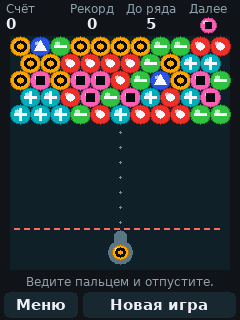
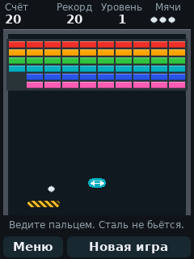
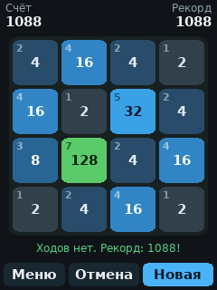

# CYD Game Shelf

[English version](README.md)

Пять игр и меню для «Cheap Yellow Display», платы ESP32 с сенсорным экраном 2,8 дюйма: «Сапёр», «Пять в линию», «Пузыри», «Кирпичи» и 2048. Интерфейс на русском и английском.

<p>
  
  
  
  
  
  
</p>

Картинки сняты с эмулятора из папки `sim/`: он выполняет тот же код игр, что и плата.

## Состояние

Правила игр и все экраны проверены на компьютере, прошивка собирается, заливается и запускается на плате. Платы отличаются друг от друга, поэтому при первом запуске что-то, скорее всего, придётся подправить; вероятные случаи описаны в разделе «Если что-то не так». «Кирпичи» — самая новая игра и единственная, которая движется без касаний, поэтому то, как её платформа слушается пальца на резистивной панели, стоит оценивать на плате, а не по картинке.

## Плата

ESP32-2432S028R с одним разъёмом micro-USB: модуль ESP-WROOM-32, экран ILI9341 240 × 320 и резистивный тачскрин XPT2046. У версии с двумя USB-разъёмами другой драйвер экрана, ей нужны другие настройки в `platformio.ini`.

## Сборка и прошивка

Проект собирается в [PlatformIO](https://platformio.org/).

```
pio run -t upload
pio device monitor
```

PlatformIO сам скачает инструменты ESP32 и библиотеку экрана TFT_eSPI. Библиотека настраивается флагами в `platformio.ini`, её файлы править не нужно.

## Первый запуск

1. **Калибровка касаний.** По очереди появляются четыре крестика. Нажмите на каждый и держите, пока он не исчезнет. Стилус или ноготь точнее подушечки пальца.
2. **Язык.** Выберите русский или английский.

То и другое запоминается. Позже это меняется в настройках.

## Игры

**Сапёр.** Два поля: 9 × 9 с 10 минами и 16 × 16 с 40 минами. Нажатие открывает клетку, долгое нажатие ставит флажок. Кнопка «Копать / Флаг» меняет их местами. Нажатие на открытое число открывает соседей, если вокруг стоит столько же флажков. В первой открытой клетке и рядом с ней мин не бывает. Рекорд времени хранится для каждого поля. На поле 16 × 16 клетки мелкие, там нужен стилус.

**Пять в линию.** Нажмите на шарик, затем на свободную клетку: шарик переедет туда, если путь свободен. Пять и больше шариков одного цвета в ряд исчезают и приносят очки. После хода без линии появляются три новых шарика. Игра кончается, когда поле заполнено.

**Пузыри.** Ведите пальцем по полю, чтобы навести пушку, и отпустите — будет выстрел; палец, отпущенный ниже пушки, отменяет его. Пунктир показывает, куда полетит пузырь, отскакивая по дороге от боковых стенок. Три и больше одного цвета, которые касаются друг друга, лопаются по 10 очков, а всё, что осталось висеть без опоры, падает и приносит по 20. Каждый пятый выстрел, который ничего не лопнул, опускает сверху новый ряд. Нажатие на пузырь под надписью «Далее» меняет его местами с заряженным. Победа — пустое поле, поражение — пузырь ниже красной черты.

**Кирпичи.** Ведите пальцем в любом месте поля — платформа повторяет движение, поэтому палец её не закрывает; нажатие запускает мяч. Чем дальше от середины платформы ударился мяч, тем круче он отлетает, и каждый удар о платформу делает его чуть быстрее. Цветной кирпич разбивается с одного удара и даёт 10 очков, тёмный прочный — со второго, после первого на нём трещина, и даёт 20, а стальной с болтами не разбивается вовсе и для прохождения уровня не нужен. Пройденный уровень приносит 100 очков, умноженные на его номер. Из разбитых кирпичей иногда падает капсула, её ловят платформой: широкая платформа, медленный мяч, три мяча сразу или лишний мяч. Мячей три; мяч, упавший мимо платформы, потерян. Стен шесть, после шестой они идут по кругу быстрее.

**2048.** Проведите пальцем по полю в ту сторону, куда должны поехать плитки. Каждая плитка едет до упора, две одинаковые при встрече сливаются в одну с суммой, и сумма прибавляется к счёту; за один ход плитка сливается только раз, поэтому 2 2 2 2 превращается в 4 4, а не в 8. После каждого хода появляется новая плитка: девять раз из десяти 2, иначе 4. Собранная 2048 — победа, после неё можно играть дальше. Игра кончается, когда поле заполнено и нет двух равных соседей. «Отмена» возвращает последний ход — только один, и после конца игры тоже. Число в углу плитки показывает, какая это степень двойки, а цвета идут от холодных к горячим по мере удвоения.

Партия остаётся в памяти, пока вы в меню или в другой игре. При выключении питания она теряется. Выход из «Кирпичей» в меню ставит партию на паузу, нажатие возвращает её.

## Меню

Полка длиннее экрана, поэтому она прокручивается: ведите пальцем по рядам, и список поедет за ним, а нажатие, которое почти не сдвинулось, открывает игру под пальцем. Полоска справа показывает, какая часть полки сейчас видна. «Настройки» стоят под списком и никуда не уезжают.

## Настройки

- Язык: RU или EN.
- Звук: простые тоны на разъёме динамика, четырьмя ступенями — выключено, тихо, средне и громко; на кнопках крестик и цифры от 1 до 3. Выбранную ступень сразу слышно в звуке, подтверждающем нажатие. Без подключённого динамика ничего не слышно.
- Экран: поворачивает картинку на 180 градусов.
- Цвета: для плат, которые показывают цвета инвертированными.
- Цвета шариков: четыре ряда цветов для шариков «Пяти в линию», пузырей и граней кирпичей, показаны друг под другом в том размере, какой у них в игре. Панели отличаются от платы к плате, поэтому различимый набор — тот, который различим именно на вашей; выберите его там. Три ряда готовые, четвёртый — ваш: нажатие на него открывает экран, где каждому шарику выбирается цвет из сетки квадратов. «Сброс» возвращает первый набор. На том же экране выбора — «Метки»: значок внутри каждого шарика, точка, кольцо, полоска и так далее, свой на каждый цвет. Метки включены изначально, потому что эти панели показывают некоторые цвета похоже друг на друга; выключите, если хотите чистые шарики.
- Калибровка касаний.
- Сброс рекордов.

## Если что-то не так

- **Касания попадают не туда, меню не работает.** Держите палец на экране или кнопку BOOT, пока плата включается. Калибровка начнётся заново.
- **Калибровка всё время сообщает, что не получилось.** Числа внизу экрана калибровки показывают сырые показания тачскрина. Если они не меняются при нажатии в разных местах, тачскрин подключён не так, как на этой плате. Те же показания идут в монитор порта.
- **Картинка вверх ногами.** Настройки, «Экран».
- **Цвета как на негативе.** Настройки, «Цвета».
- **Красный и синий поменялись местами.** Добавьте `-DTFT_RGB_ORDER=TFT_RGB` в `build_flags` в `platformio.ini`. Если стало хуже, поставьте `TFT_BGR`.
- **Экран остаётся белым или чёрным.** Обычно это версия платы с двумя USB. Ей нужен `-DST7789_DRIVER=1` вместо `-DILI9341_2_DRIVER=1`.

## Корпус

В папке `case/` лежит корпус для фотополимерной печати: плата питается от двух батареек AA, есть выключатель, динамик и карман для стилуса. Файлы для печати, список деталей и порядок сборки в [case/README.ru.md](case/README.ru.md).

## Проверка на компьютере

```
sim/run.sh
```

Скрипт собирает игры компилятором `g++`, разыгрывает по нескольку сотен партий каждой для проверки правил, проходит все экраны «пальцем» по сценарию и сохраняет картинки экранов в `sim/out`. Нужны только `g++` и Python, больше ничего.

## Файлы

- `src/app.cpp`: касания, звук, настройки, калибровка, меню.
- `src/game_mines.cpp`, `src/game_lines.cpp`, `src/game_bubbles.cpp`, `src/game_bricks.cpp`, `src/game_2048.cpp`: игры.
- `src/ui.cpp`, `src/font_data.cpp`: вывод текста и шрифты. Шрифты создаёт `tools/make_font.py`.
- `src/strings.cpp`: все тексты на двух языках.
- `src/hw.h`: что играм нужно от платы. На плате это даёт `src/hw_esp32.cpp`, на компьютере `sim/hw_host.cpp`.
- `case/`: корпус, его модель и файлы для печати.

## Авторство

Прошивку написал Claude, ИИ-ассистент компании Anthropic: логику игр, экраны, обработку касаний и эмулятор.

Идея и выбор игр принадлежат posoxAI. Все пять игр перенесены с браузерных оригиналов, в них можно поиграть прямо сейчас: «Сапёр» ([играть](https://posoxai.github.io/MinesweeperGame/), [код](https://github.com/posoxAI/MinesweeperGame)), «Пять в линию» ([играть](https://posoxai.github.io/FiveInLineGame/), [код](https://github.com/posoxAI/FiveInLineGame)), «Пузыри» ([играть](https://posoxai.github.io/Bubbles/), [код](https://github.com/posoxAI/Bubbles)), «Кирпичи» ([играть](https://posoxai.github.io/Bricks/), [код](https://github.com/posoxAI/Bricks)) и 2048 ([играть](https://posoxai.github.io/2048/), [код](https://github.com/posoxAI/2048)). Правила 2048 придуманы Габриэле Чирулли в 2014 году. Остальные игры собраны в [Игротеке](https://posoxai.github.io/posoxAI/).

Корпус в папке `case/` тоже спроектировал Claude, по замерам и пробным печатям posoxAI.

Буквы нарисованы шрифтами DejaVu, их можно свободно использовать и встраивать.

## Лицензия

MIT. Полный текст в файле [LICENSE](LICENSE).
