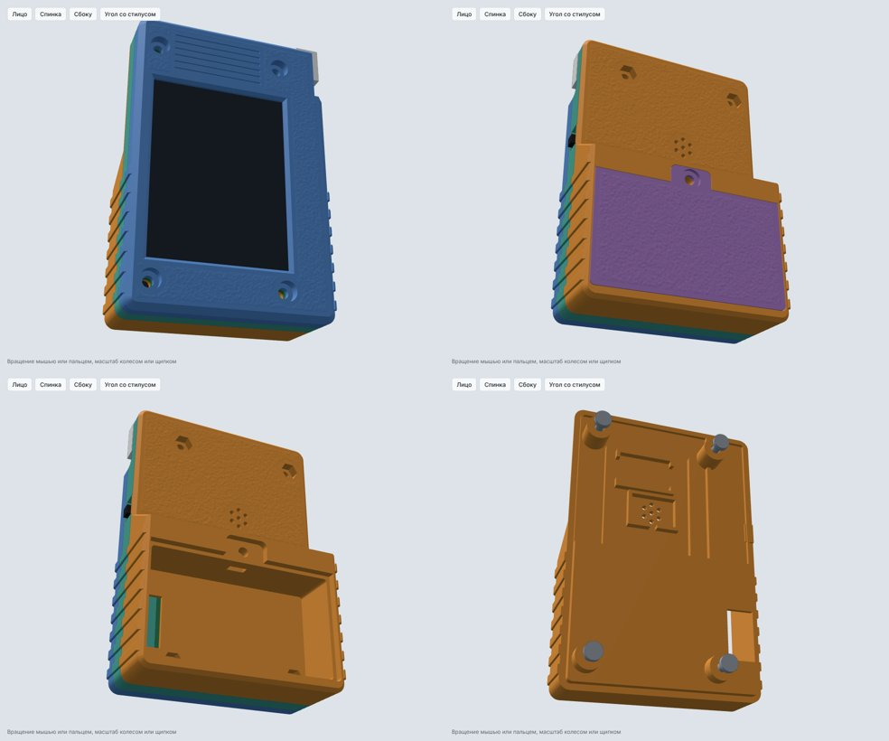

# Case

[Русская версия](README.ru.md)

A 3D-printed case for the board, made for a resin printer. It runs on two AA cells, has a power switch, room for a speaker and a pocket for the stylus.



## Status

Draft 4, printed and assembled. Draft 3 fitted, but two walls cracked when the parts came off the build plate and its sliding battery door was too flimsy, so draft 4 has thicker walls and a screwed battery lid. The back now also has a nail catch at the screw end of the lid, so the lid lifts easily once the screw is out; that last change has not been printed yet.

## Size

97.6 × 65.6 mm, 66.8 mm over the grip ribs. 16.7 mm thick, 31.9 mm over the battery step at the antenna end.

## Printed parts

Four layers, held together by the screws through the board's mounting holes:

- `stl/cyd-case-face.stl`: the screen side, with the window and the stylus channel.
- `stl/cyd-case-frame.stl`: the middle frame with the switch.
- `stl/cyd-case-back.stl`: the back with the battery step, the speaker and converter pockets and stiffening ribs inside.
- `stl/cyd-case-battery-lid.stl`: the battery lid.

The STL files carry a fine matte texture on the face, the back and the lid. The STEP files in `step/` are the same parts without the texture, for editing in a CAD program; `cyd-case-assembly.step` also holds stand-ins for the board and the bought parts.

Walls are 2.8 mm, 4.5 mm at the antenna end where the lid hooks go in. Let the resin drain and the build plate cool before taking the parts off, and lift them from the face side rather than by the walls.

## Bought parts

- 2 × AA holder with leads, 59 × 33 × 16 mm.
- Adafruit MiniBoost 5V, product 4654: it turns the 2–3 V of the cells into 5 V for the board.
- An 8 Ω speaker about 15 × 10 × 3 mm.
- A slide switch with mounting ears, 19.7 mm across the ears.
- The stylus, 87.5 mm long and 5 mm thick, with a 12 × 8 × 5 mm head.
- M3 button-head screws: 2 × 12 mm and 3 × 8 mm. Five M3 nuts.

## Wiring

Battery holder → switch → converter input; converter output → `P1` on the board, `VIN` and `GND`. The speaker goes to the `SPEAK` connector.

## Assembly

1. Lay the face down, put the board in screen first, then the frame on top.
2. Push the switch into the frame from the back and run its wires.
3. Put the speaker and the converter into their pockets in the back and place the back on the frame.
4. Screws go in from the face. The two M3 × 12 at the USB end take their nuts in the hex pockets on the outside of the back. The two M3 × 8 at the antenna end take their nuts in the pockets on the battery shelf.
5. Slide the lid's nut sideways into its slot at the far end of the battery pocket, then put the holder in, leads towards the switch side; they go down through the slot in the shelf.
6. Lid: hook its two tabs under the antenna-end wall, lower it and fix it with the last M3 × 8. To open it, take the screw out and lift the lid by the nail catch at that end.

## Changing the model

```
pip install cadquery manifold3d trimesh scipy
python3 case.py            # builds the parts into out/, checks that nothing overlaps
python3 texture.py micro   # adds the texture, writes out-micro/
```

`case.py` holds every dimension at the top. It prints `overlapping pairs: 0` when the parts, the board and the bought parts all fit. `texture.py peel` gives a coarser "orange peel" texture instead.

## Credits

The case was designed by Claude, the AI assistant made by Anthropic, from posoxAI's measurements, sketches and test prints.
